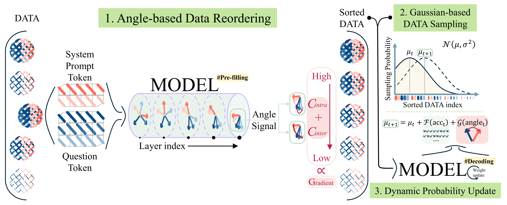

# **Angles Don’t Lie: Unlocking Training-Efficient RL Through the Model’s Own Signals**

###  NeurIPS 2025 Spotlight

[Qinsi Wang](https://wangqinsi1.github.io/)<sup>1</sup>, [Jinghan Ke](https://ah-miu.github.io/)<sup>2</sup>, [Hancheng Ye](https://openreview.net/profile?id=%7EHancheng_Ye1)<sup>1</sup>, [Yueqian Lin](https://openreview.net/profile?id=~Yueqian_Lin2)<sup>1</sup>, [Yuzhe Fu](https://yuzhe-fu.github.io/)<sup>1</sup>, [Jianyi Zhang](https://jayzhang42.github.io/graphical_homepage/)<sup>1</sup>, [Kurt Keutzer](https://scholar.google.com/citations?user=ID9QePIAAAAJ&hl=en&oi=ao)<sup>2</sup>, [Chenfeng Xu](https://www.chenfengx.com/)<sup>2\*</sup>, [Yiran Chen](https://scholar.google.com/citations?user=3G-nnjMAAAAJ&hl=en&oi=ao)<sup>1\*</sup>

<sup>1</sup>Duke University, <sup>2</sup>University of California, Berkeley, <sup>*</sup>corresponding author

### TL;DR

In this paper, We show that **the angle concentration of hidden‑state vectors is an intrinsic indicator of how much an LLM can learn from a sample, tightly correlating with gradient strength.** Leveraging this signal, **GAIN‑RL** dynamically selects the most informative examples each epoch, keeping gradient updates impactful and slashing the sample waste that plagues standard RFT. On diverse math and coding benchmarks—and at multiple model scales—GAIN‑RL delivers >2.5× faster training and beats vanilla GRPO with just half the original data.

Paper Link: [https://arxiv.org/abs/2506.02281](https://arxiv.org/abs/2506.02281)

### Overview

**Overview of GAIN-RL.** GAIN-RL consists of three steps: *(1) Angle-based Data Reordering*: Before training, the model pre-fills all data and ranks them by the combined angle concentration signals: $C_{\text{inter}} + C_{\text{intra}}$. *(2) Gaussian-based Data Sampling*: During training, each epoch begins by sampling reordered data using a Gaussian distribution. *(3) Dynamic Probability Update*: Epoch-wise accuracy and angle concentration are collected to dynamically update $µ_{t+1}$. GAIN-RL guides the model to focus on high-angle, high-loss data, promoting effective gradients and faster convergence.


### **The current release version includes:**

✅  **Release all trained models and data:** We released all trained models and the data used.

✅  **Integrated GAIN-RL into [verl](https://github.com/volcengine/verl/tree/main):**  We implemented GAINRL on `verl`. You can enable GAINRL simply by adding `data.gainrl.enable=enable` to the command line.

✅  **Integrated GAIN-RL into [trl](https://github.com/huggingface/trl):**  We provide GAINRL training script using `transformers.Trainer`  and `trl`. You can now easily use GAIN-RL and make changes.

✅  **Comprehensive performance evaluation:** We provide evaluation scripts for different datasets in *evaluation/*, taking into account the characteristics of different datasets.


### **To Do List:**
- [ ] Publish the code that runs on the code task.


## GainRL Model and Dataset
| Model       |  Link|
| ----------- | --------- |
| Qwen2.5-Math-0.5B-Instruct-GSM8K/MATH/AMC  | [Qinsi1/GAINRL-Qwen2.5-0.5B-Instruct](https://huggingface.co/Qinsi1/GAINRL-Qwen2.5-0.5B-Instruct)|
| Qwen2.5-Math-1.5B-Instruct-Deepscaler  | [Qinsi1/GAINRL-Qwen2.5-Math-1.5B-Instruct](https://huggingface.co/Qinsi1/GAINRL-Qwen2.5-Math-1.5B-Instruct)|
| Qwen2.5-Math-7B-Instruct-Deepscaler    | [Qinsi1/GAINRL-Qwen2.5-Math-7B-Instruct](https://huggingface.co/Qinsi1/GAINRL-Qwen2.5-7B-Instruct)|
| LLaMA-3.2-3B-Instruct-Deepscaler | [Qinsi1/GAINRL-LLaMA-3.2-3B-Instruct](https://huggingface.co/Qinsi1/GAINRL-LLaMA-3.2-3B-Instruct)|
| Qwen2.5-Coder-3B-Instruct-Deepcoder   | [Qinsi1/GAINRL-Qwen2.5-Coder-3B-Instruct](https://huggingface.co/Qinsi1/GAINRL-Qwen2.5-Coder-3B-Instruct) |
| Math+Code Data  | [Qinsi1/angle_data](https://huggingface.co/Qinsi1/angle_data) |


## Step 1: Data Processing

Before training begins, GAINRL needs to sort the training data based on angular concentration according to the model being trained. This step only involves pre-filling stage, so it is fast (approximately 10 minutes). Only basic libraries including `transformers` and `datasets` are required to run this step.

We provide the dataset JSON files (including GSM8K, MATH, AMC, DEEPSCALER) used in the paper under the `dataset/` directory. Alternatively, you can manually place your own dataset files in the `dataset/` folder. Run the following steps to process the data.

```python
python data_processor.py 
--model_name [HUGGINGFACE_URL/LOCAL_PATH OF MODEL] 
--dataset_path [PATH OF DATASET]
--save_path [PATH OF PROCESSED DATA]
--gpu_id [ID OF UDED GAPU]
```

Example:

```python
python data_processor.py 
--model_name Qwen/Qwen2.5-0.5B-Instruct 
--dataset_path dataset/math_train.json 
--save_path angle_sorted_data/qwen2_5_05b_Instruct/processed_math.pt 
--gpu_id 1
```

The processed data will be saved under the `angle_sorted_data/` directory. **We also provide a subset of preprocessed data in `angle_sorted_data/`, which you can use for training directly.**


## Step 2: Training with GAINRL

We provide two options for training: **`verl`** and **`trl` + `transformers.Trainer`**. You can choose the framework you're more familiar with. In general, `verl` is better suited for efficient large-scale training, while `transformers.Trainer` with `trl` offers a simpler interface for modifying the code.

### [Training on `verl`]

**1. Environment Setup:** Navigate to the directory `cd verl_gainrl`, and follow the instructions in the [install doc](https://verl.readthedocs.io/en/latest/start/install.html) to set up the environment.

**2. Training with GAINRL:** We provide training scripts under `verl_gainrl/examples/gainrl_grpo/`. You can easily start training by using these scripts. You can also enable GAINRL by setting the following flags in your training command:

```python
python3 -m verl.trainer.main_ppo \
    ... \
    data.gainrl.enable: Ture
    data.gainrl.n: [STEP SIZE]
    data.gainrl.beta: [TARGET ACC]
    data.gainrl.alpha: [SENSITIVITY TO ANGLE]
    data.gainrl.adj_max: [MAX STEP]
    data.gainrl.adj_min: [MIN STEP]
    data.gainrl.processed_file: [PATH TO PROCESSED DATA]
    ...
```

 Example:

```python
python3 -m verl.trainer.main_ppo \
    ... \
    data.gainrl.enable: Ture
    data.gainrl.n: 500
    data.gainrl.beta: 0.5
    data.gainrl.alpha: 2
    data.gainrl.adj_max: 1000
    data.gainrl.adj_min: 0
    data.gainrl.processed_file: ../angle_sorted_data/qwen2_5_05b_Instruct/processed_gsm8k.pt
    ...
```


### [Training on `trl` + `transformers.Trainer`]

**1. Environment Setup:** Navigate to the trl directory and install the required environment.

```
cd trl_gainrl
conda create -yn gainrl python=3.10
conda activate gainrl
pip install -e .
cd ..
```

**2. Training with GAINRL:** We provide simple training scripts to help you get started easily. You can start training using the following command:

```python
python trl_gainrl/gainrl_trainer.py \
--dataset [DATASET NAME] \
--dataset_path [DATASET PATH] \
--model_name [MODEL PATH] \
--indices_path [PROCESSED DATA PATH] \
--gpu_id [GPU ID] \
--output_dir [OUTPUT DIRECTORY] \
--learning_rate [LEARNING RATE] \
--batch_size [BATCH SIZE] \
--num_epochs [NUMBER OF EPOCHS] \
--subset_size [SUBSET SIZE] \
--max_prompt_len [MAX PROMPT LENGTH] \
--max_completion_len [MAX COMPLETION LENGTH] \
--num_generations [NUM GENERATIONS PER SAMPLE] \
--gradient_accumulation_steps [GRADIENT ACCUMULATION STEPS] \
--save_steps [SAVE STEPS] \
--logging_steps [LOGGING STEPS]
```

Example: 

```python
python trl_gainrl/gainrl_trainer.py \
--dataset math \
--dataset_path ./dataset/math_train.json \
--model_name Qwen/Qwen2.5-0.5B-Instruct \
--indices_path ./angle_sorted_data/qwen2_5_05b_Instruct/processed_math.pt \
--gpu_id 1
```

By default, the trained model will be saved to the `trl_gainrl/output/` directory.


## Step 3: Evaluation

We provide evaluation scripts in the `evaluation/` directory, each tailored to different datasets based on their specific answer formats (e.g., integers, fractions, etc.). You can run evaluation using the following command:

```Shell
python evaluation/eval_[TASK].py \
--model_path [MODEL PATH] \
--dataset_path [DATASET PATH] \
--batch_size [BATCH SIZE]
```

Example：

```Shell
python evaluation/eval_gsm8k.py \
--model_path Qwen/Qwen2.5-0.5B-Instruct \
--dataset_path dataset/gsm8k_eval.json \
--batch_size 8
```


## Paper and Citation

More technical details can be found in our paper. If you find GAINRL useful or relevant to your project and research, please kindly cite our paper:

```
@misc{wang2025anglesdontlieunlocking,
      title={Angles Don't Lie: Unlocking Training-Efficient RL Through the Model's Own Signals}, 
      author={Qinsi Wang and Jinghan Ke and Hancheng Ye and Yueqian Lin and Yuzhe Fu and Jianyi Zhang and Kurt Keutzer and Chenfeng Xu and Yiran Chen},
      year={2025},
      eprint={2506.02281},
      archivePrefix={arXiv},
      primaryClass={cs.LG},
      url={https://arxiv.org/abs/2506.02281}, 
}
```

## License
This project is licensed under the MIT License.

